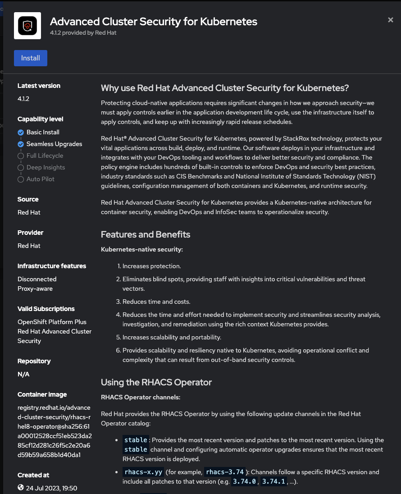
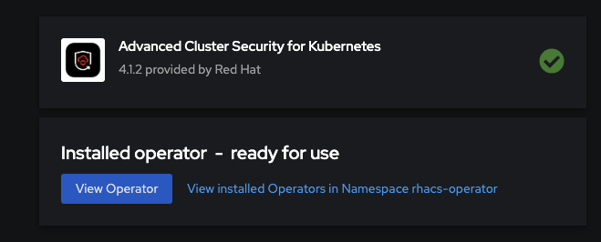
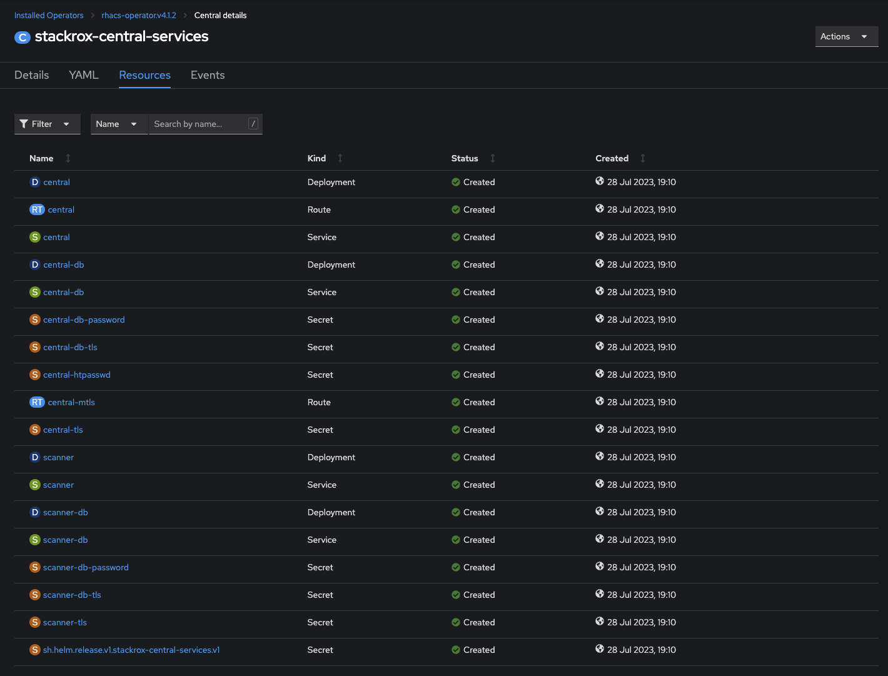
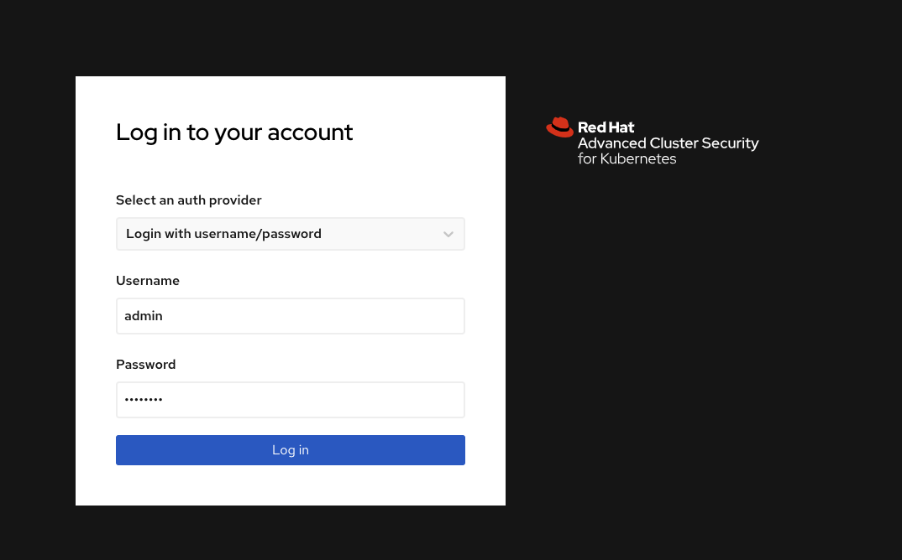
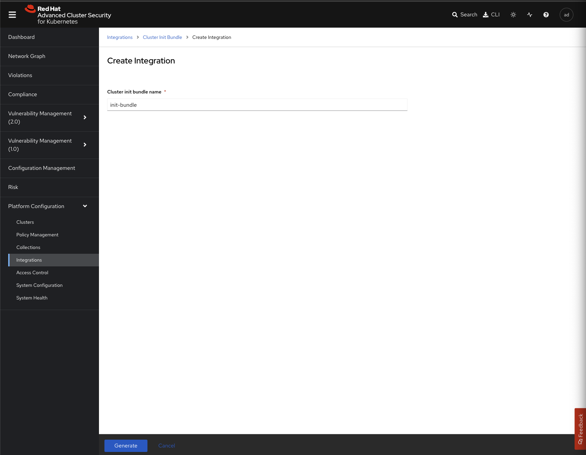
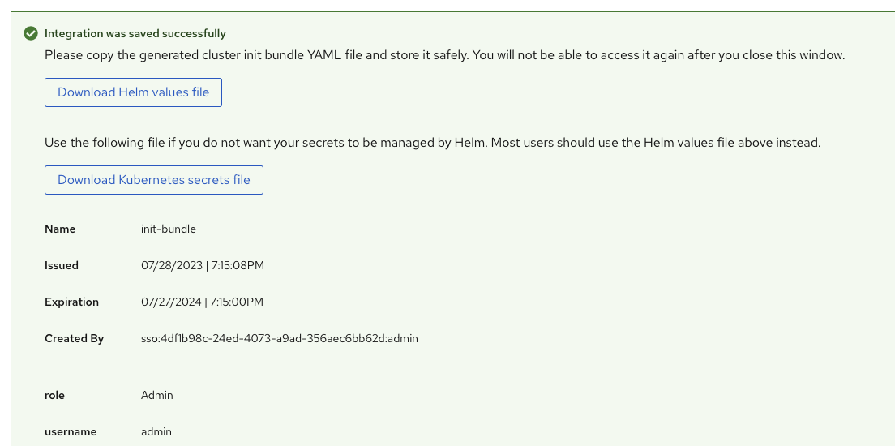
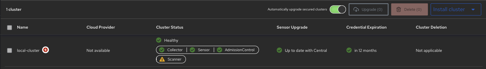

# First Log in to the cluster:

kubectl login --token=token --server=https://api_cluster_url:6443


# Install ACS with the yamls:

## First we create the namespaceinstall ACS: 

oc apply -f bootstrap/base/00_acs/00_create_namespaces 
### namespace/rhacs-operator created
### namespace/stackrox created
### secret/acs-password created

## Second we install the ACS

oc apply -f bootstrap/base/00_acs/01_install_acs       
### subscription.operators.coreos.com/rhacs-operator created
### role.rbac.authorization.k8s.io/acs-cluster-init-role created
### rolebinding.rbac.authorization.k8s.io/acs-cluster-init-rb created
### serviceaccount/acs-gitops created
### central.platform.stackrox.io/stackrox-central-services created

## Third we impor the local cluster:

oc apply -f bootstrap/base/00_acs/02_import_cluster 
### job.batch/acs-init-bundle created
### securedcluster.platform.stackrox.io/stackrox-secured-cluster-services created

## And we are DONE !


# Install ACS With Kustomize and ArgoCD or ArgoCD+ACM:

## We install using argocd and kustomize:

oc apply -k ./bootstrap/base/01_acs_with_argocd
### application.argoproj.io/redhat-acs created

## And we are DONE !

# Install ACS by hand:
### We create the ACS Namespace and secret
```
---
apiVersion: v1
kind: Namespace
metadata:
 labels:
    argocd.argoproj.io/sync-wave: "0"
 name: stackrox
spec: {}
---
kind: Secret
apiVersion: v1
metadata:
  name: acs-password
  namespace: stackrox
  annotations:
    argocd.argoproj.io/sync-wave: "2"
data:
  password: cmVkaGF0MDE=
type: Opaque
```
### From the Operator Hub we search for: 

Advanced Cluster Security for Kubernetes



### We click install, review the configuration (default is okey) and we click Install again.
### Then we wait for it to finish

### We click on view Operator and we go to Central => Create Central and we paste the following yaml:

```
---
apiVersion: platform.stackrox.io/v1alpha1
kind: Central
metadata:
  name: stackrox-central-services
  namespace: stackrox
  annotations:
    argocd.argoproj.io/sync-wave: "3"
    argocd.argoproj.io/sync-options: SkipDryRunOnMissingResource=true
spec:
  central:
    adminPasswordSecret:
        name: acs-password
    exposure:
      loadBalancer:
        enabled: false
        port: 443
      nodePort:
        enabled: false
      route:
        enabled: true
    db:
      isEnabled: Default
      persistence:
        persistentVolumeClaim:
          claimName: central-db
    persistence:
      persistentVolumeClaim:
        claimName: stackrox-db
  egress:
    connectivityPolicy: Online
  scanner:
    analyzer:
      scaling:
        autoScaling: Enabled
        maxReplicas: 5
        minReplicas: 2
        replicas: 3
    scannerComponent: Enabled
```
### and we click Create
### We go to the stackrox-central-services we click in Resources and we locate the route or in the Namespace Stackrox => Routes:

### We log into the ACS Central web console using the credentials admin / redhat01

### Now we go to integrations => Cluster Init Bundle - Generate Bundle => we type init-bundle and click generate:

### We now have to download either the Helm or Kubernetes file for importing the cluster:

### We apply the yaml on the cluster:
oc apply -f init-bundle-cluster-init-secrets.yaml -n stackrox
### secret/collector-tls created
### secret/sensor-tls created
### secret/admission-control-tls created
### And for the last step we go to the ACS Operator and we click on Create Secured Cluster and we paste the following yaml and click Create:
```
apiVersion: platform.stackrox.io/v1alpha1
kind: SecuredCluster
metadata:
  name: stackrox-secured-cluster-services
  namespace: stackrox
  annotations:
    argocd.argoproj.io/sync-wave: "5"
spec:
  admissionControl:
    listenOnCreates: true
    listenOnEvents: true
    listenOnUpdates: true
  clusterName: local-cluster
  perNode:
    collector:
      collection: KernelModule
      imageFlavor: Regular
    taintToleration: TolerateTaints
```
### We wait for it to import


## and we are DONE!